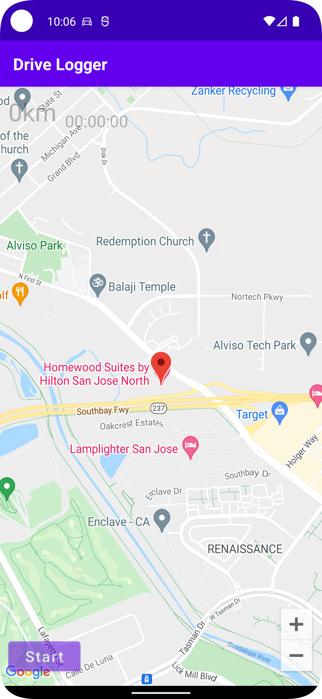
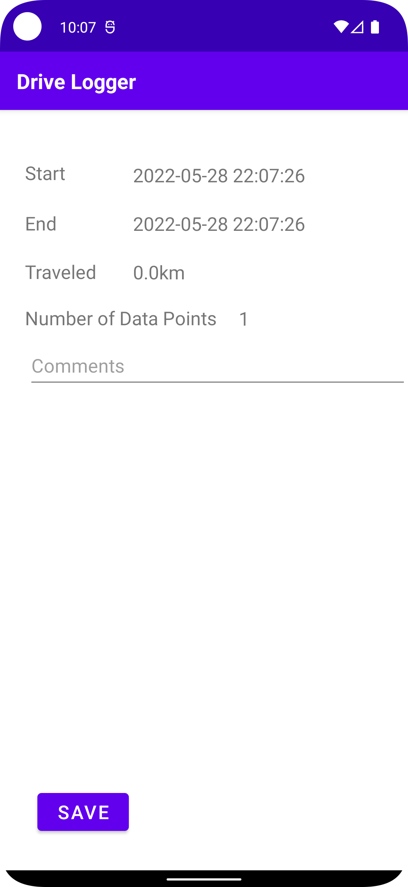

# Drive Logger

This is a GPS logger program.

# Current state of this project (as of 2022/05/29)

Tracked route can be saved but no use afterward.
Data points from GPS are tracked asis without eliminating uncertain data.

# Before you compile

You must get api key for google-map and put it into local.properties as MAPS_API_KEY key.